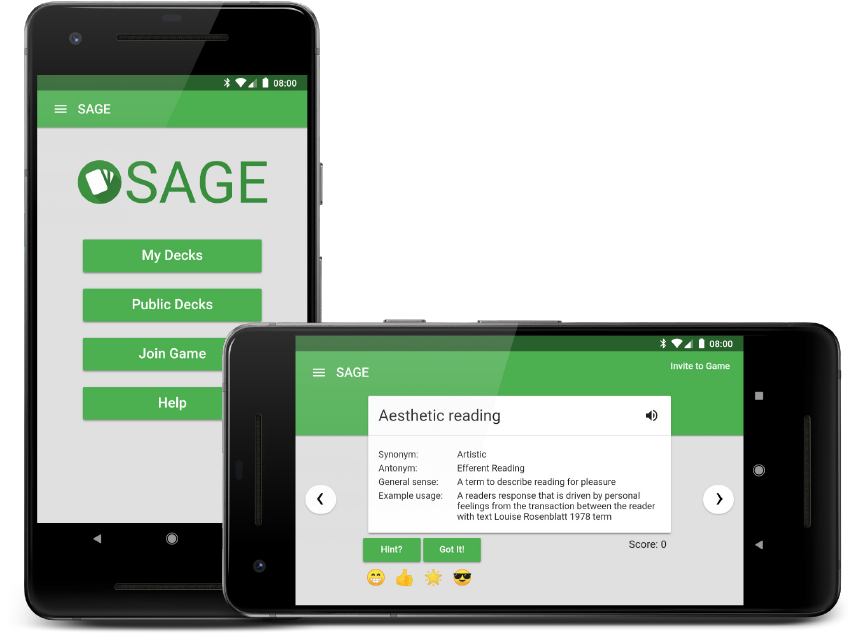
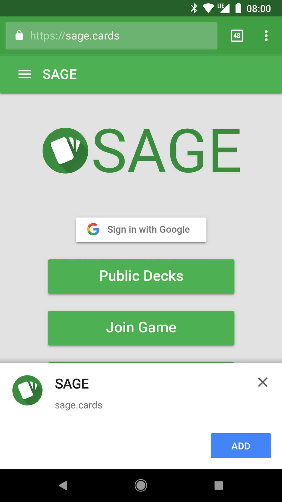
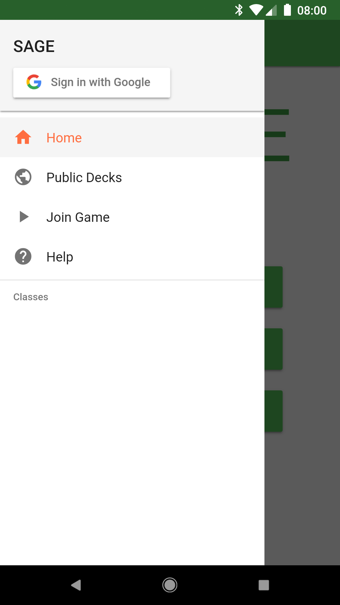
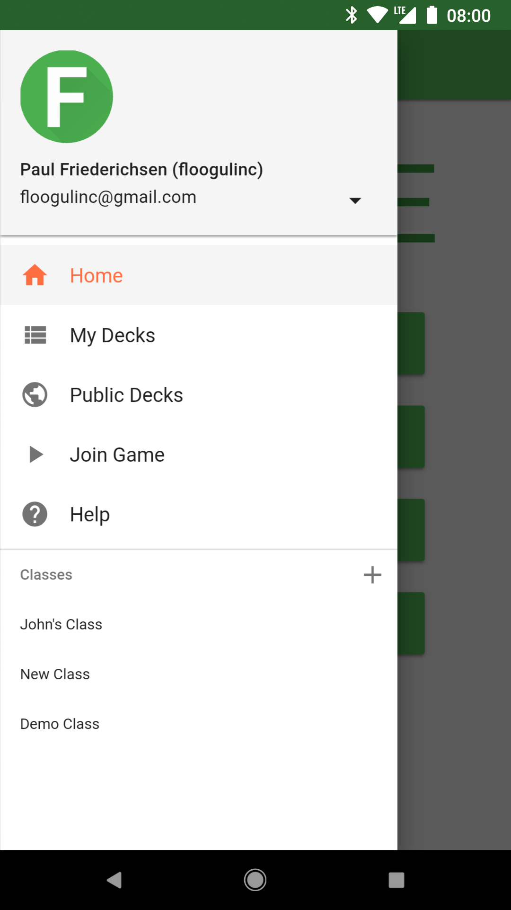
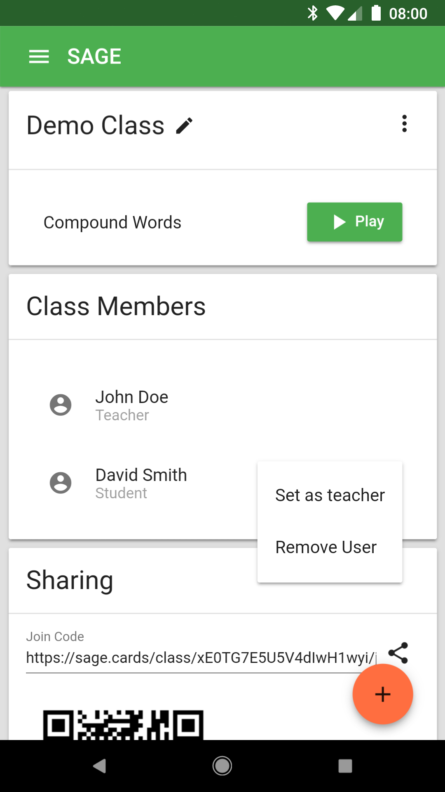
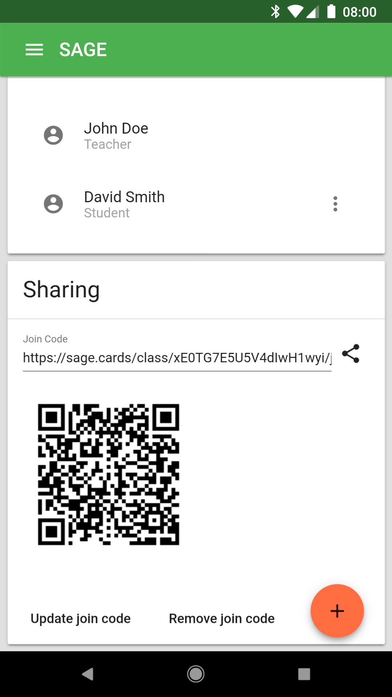
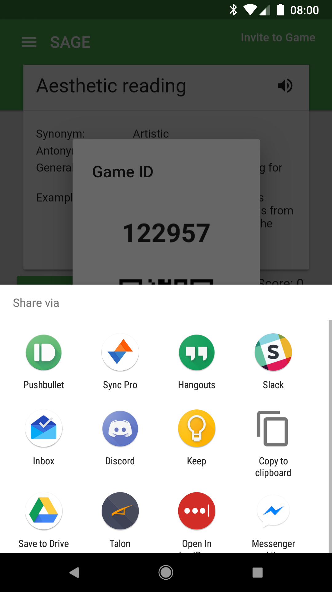

<style type="text/css">
  td {
    border-bottom: none;
    padding-bottom: 3px;
    padding-top: 3px;
  }
</style>


<h1 style="margin-top: 0px">CSCI 3601 Portfolio</h1>
{:.no_toc}

Software Design and Development

[Paul Friederichsen](https://floogulinc.com)

[[GitHub Repository](https://github.com/UMM-CSci-3601-F17/sage-team-cheezit)] 
[[Live Instance](https://sage.cards/)]

## Contents
{:.no_toc}

* TOC
{:toc}

## The Project

SAGE is a game for teachers and students who want a way to improve student vocabulary. SAGE is based on a game played on index cards and follows the same rules. Here is a brief overview from our project's [readme](https://github.com/UMM-CSci-3601-F17/sage-team-cheezit/blob/master/README.md):

<blockquote style="font-style: normal">
  SAGE is an acronym for synonyms, antonyms, general sense, and example usage. A SAGE card includes a word and has one hint from each of the 4 listed categories. In a game of SAGE, there are a number of cards the player will be presented with, each of them being worth points. The player is initially given just the word for a card. It is up to them to either guess the meaning of that word, or ask for a hint at the expense of some points.
</blockquote>
<blockquote style="font-style: normal">
  The game is played between at least 2 people, with one or more people trying to guess the meaning of a word through hints and one person controlling the game and deciding whether they are right or wrong.
</blockquote>

### Features

Here are some of the important features of SAGE:

- **User Accounts** allow students and teachers to have their own decks, cards, and classes. SAGE uses Google Sign In 
- **Classrooms** allow teachers to share decks with a class of students, it is complete with student, deck, and invite managment.
- **Decks** hold SAGE cards and can be moved between classes. They are what is selected when playing SAGE.
- **Multiplayer** allows multiple students to join a SAGE game on their devices. Game invites can be shared eaisly with a numerical code or a QR code. There is also a share button to quickly share the invite URL on your mobile device.



## Tooling

SAGE makes use of many tools and libraries.

SAGE is powered by:
- [Angular](https://angular.io/)
- [Angular Material](https://material.angular.io/)
- [Teradata Covalent](https://teradata.github.io/covalent/)
- [Firebase](https://firebase.google.com/)
    - [Cloud Firestore](https://firebase.google.com/products/firestore/)
    - [Realtime Database](https://firebase.google.com/products/realtime-database/)
    - [Authentication](https://firebase.google.com/products/auth/)
    - [Hosting](https://firebase.google.com/products/hosting/)
- [AngularFire](https://github.com/angular/angularfire2) 

Other libraries used:
- [ng2-page-slider](https://github.com/KeatonTech/Angular-2-Page-Slider)
- [ng2-rx-componentdestroyed](https://github.com/w11k/ng2-rx-componentdestroyed)
- [ngx-qrcode2](https://github.com/techiediaries/ngx-qrcode)
- [ngx-pipes](https://github.com/danrevah/ngx-pipes)
- [ngx-clipboard](https://github.com/maxisam/ngx-clipboard)
- [time-ago-pipe](https://github.com/AndrewPoyntz/time-ago-pipe)

Tools:
- [Angular CLI](https://cli.angular.io/)
- [Yarn](https://yarnpkg.com/)
- [TypeScript](https://www.typescriptlang.org/)
- [Karma](https://karma-runner.github.io/1.0/index.html)
- [Jasmine](https://jasmine.github.io/)

The project makes use of [TravisCI](https://travis-ci.org/) to build and run tests with every commit and pull request.
[](https://travis-ci.org/UMM-CSci-3601-F17/sage-team-cheezit)

We used [IntelliJ IDEA‎](https://www.jetbrains.com/idea/) as our IDE and made use of [BrowserStack](https://www.browserstack.com/) for testing on various devices.

## Development Process

We implemented an agile approach to the development of SAGE. We used [ZenHub](https://www.zenhub.com/) for project management in GitHub as well as [Slack](https://slack.com/) for team communication.

### Stories and Customer Involvment

At the beginning of each of our 4 iterations the team came up with stories to present to the customer. We gave each story points based on how much work we deemed it would take. We then met and presented these stories to the customer allowing her to choose the ones she liked within a story point limit we set based on how much we thought we could get done in the iteration. 

### Teamwork and Communication

We frequently worked together, both in person and remotely. Throughout the project we used pair programming and worked out problems on the whiteboard together. We also made heavy use of Slack and ZenHub for communication. We required code review to merge pull requests as well as for testing on TravisCI to pass.

## My Contribution

I contributed a majority of code in the project with 196 commits and 17,266 lines added.

### Angular Material

At the beginning of the project I switched the Bootstrap UI used in the template we were given to [Angular Material](https://material.angular.io/) and [Covalent](https://teradata.github.io/covalent/) in [this pull request](https://github.com/UMM-CSci-3601-F17/interation-1-drop-table-teams/pull/9)

### Basic Decks and Cards

Early in the project, I added

- [Showing decks and cards on the frontend as well as the beginning of the play view](https://github.com/UMM-CSci-3601-F17/interation-1-drop-table-teams/pull/21)
- [Adding cards on the frontend](https://github.com/UMM-CSci-3601-F17/interation-1-drop-table-teams/pull/22)
- [The basic server API for these features](https://github.com/UMM-CSci-3601-F17/interation-1-drop-table-teams/pull/15)
- [Deck creation](https://github.com/UMM-CSci-3601-F17/interation-1-drop-table-teams/pull/31)

### Firebase

I lead our team's decision to switch from our backend stack of the Spark Framework on Java and MongoDB to [Firebase](https://firebase.google.com/) and [rewrote our existing application to use it](https://github.com/UMM-CSci-3601-F17/sage-team-cheezit/pull/25). I switched us to using the new [Cloud Firestore](https://firebase.google.com/products/firestore/) database from Firebase rather than their Realtime Database as Cloud Firestore is more like the database we were using and had many nice features for the type of data we are dealing with.


### Graphics

I also designed an icon for the app as well as adding the ability to add SAGE to your homescreen, which uses this icon.


### Web App Manifest and Service Worker

I implemented a [web app manifest](https://developers.google.com/web/fundamentals/web-app-manifest/) to allow users to eaisly add SAGE to their homescreens where it can act like a native app. I also added information in the manifest and the HTML for our new icon and a theme color that shows in various mobile browsers.

<div style="float: right; width: 40%; margin-left: 10px">

  

  The browser will prompt the user to add SAGE to their homescreen

</div>

The `manifest.json` looks like this:
```json
{
    "name": "SAGE",
    "short_name": "SAGE",
    "icons": [
        {
            "src": "/android-chrome-192x192.png",
            "sizes": "192x192",
            "type": "image/png"
        },
        {
            "src": "/android-chrome-512x512.png",
            "sizes": "512x512",
            "type": "image/png"
        }
    ],
    "theme_color": "#43a047",
    "background_color": "#4caf50",
    "start_url": "/",
    "display": "standalone"
}

```

I also added a [service worker](https://developers.google.com/web/fundamentals/primers/service-workers/) which caches the app so it loads fast and doesn't use as much data. It combined with Firebase's persistence option allows SAGE to work offline, any decks the user has already viewed at least once will be cached on the device and available to look through and play while offline.

### Users and Classes

I added user accounts and classes in [this pull request](https://github.com/UMM-CSci-3601-F17/sage-team-cheezit/pull/29). I implemented user accounts using [Firebase Authentication](https://firebase.google.com/docs/auth/). I added a "Sign in with Google" button following their guidelines for design and added UI for when a user is signed in, showing their profile picture and name.

| Signed out | Signed in |
|  |  |

Classes contain decks and the "teacher" of the class can invite other users by sending them a link to join the class. New users will be students by default but a teacher can change other users from students to teachers and back. Students also were given the option to leave a class while teachers have the option to delete a class.

When a user joins a class the join code is actually added to a document by their user ID, that join code is then checked by Firestore's permission rules against the join code of the class before allowing them to join.

|  |  |
| A class showing the teacher's options for a student | The class sharing section |

### Multiplayer

I used the [Firebase Realtime Database](https://firebase.google.com/products/realtime-database/) to implement multi-device multiplayer for our existing gameplay. The user who is leading the game simply taps the "Invite to Game" button to make their current game multiplayer and invite players. When this button is tapped, a new game ID is generated and the current state of their game is sent to the Realtime Database keyed by the game code. But before sending any game data ut sets up the database so it will delete the game if the sending player disconnects. 

This code shows the setup for starting a game, `showGameID()` is called when the "Invite to Game" button is pressed:
```ts
showGameId() {

  if (!this.multiplayer) { // if the game isn't multiplayer yet
    this.gameId = this.randNumDigits(6).toString(); // generate the game ID

    // generate the URL for sharing the game
    this.gameURL = document.location.origin + this.router.createUrlTree(['/joingame'], {
      queryParams: {
        id: this.gameId
      }
    }).toString();

    // the reference to the new game ID in the database
    const ref = firebase.database().ref('games').child(this.gameId); 

    // tells the database to remove the game if the user disconnects
    ref.onDisconnect().remove().then(() => {
      return this.updateGame(); // sends the game data to the database
    }).then(() => {
      this.multiplayer = true;

      // open the dialog showing the game ID and QR code
      this.dialog.open(GameJoinDialogComponent, {
        data: {
          gameId: this.gameId,
          gameURL: this.gameURL
        },
      })
    }).catch(() => {

      // display an error if the game cannot be created
      this.snackBar.open("Error starting game", null, { 
        duration: 2000,
      });
    })
  } else { // if the game is already multiplayer, just open the dialog
    this.dialog.open(GameJoinDialogComponent, {
      data: {
        gameId: this.gameId,
        gameURL: this.gameURL
      },
    })
  }
}
```

### Easy Sharing

<div style="float: right; width: 30%; margin-left: 10px">

  

  Sharing a game invite

</div>

To invite a user to a class or a game, they need to share a URL. The app provides QR codes for this, but to add another option I added a button using the new [Web Share API](https://developers.google.com/web/updates/2016/09/navigator-share) to allow users with browsers that support it to eaisly share a class or game invite using the built in share menu of their device.

Example code for sharing a class:
```ts
browserShareInvite() {
  if (navigator.share) {
    navigator.share({
      title: 'Invite to SAGE class: ' + this.currentClass.name,
      url: this.joinUrl,
    });
  }
}
```

### Promotional Materials

I designed a promotional brochure for SAGE. The PDF is [here](sage-brochure.pdf).
